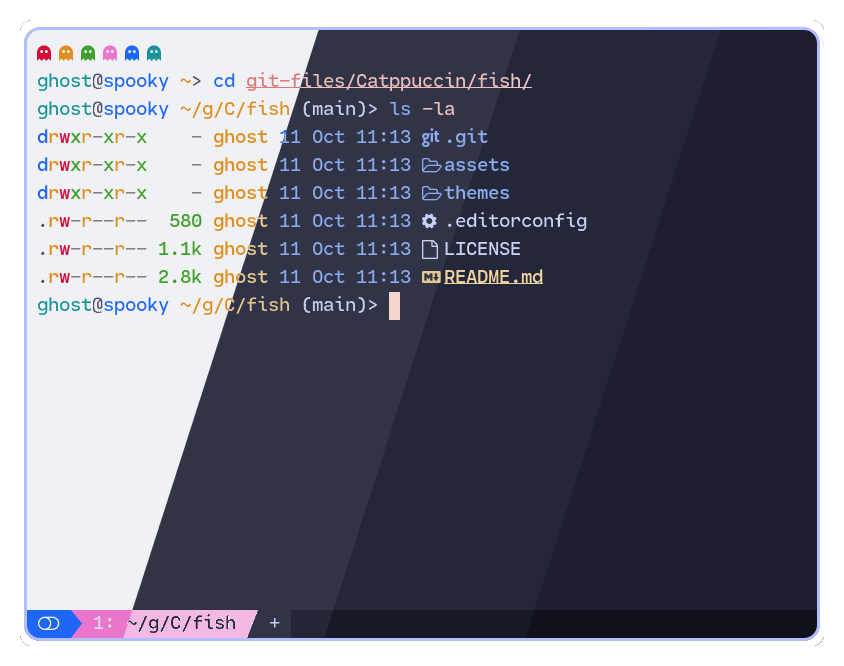
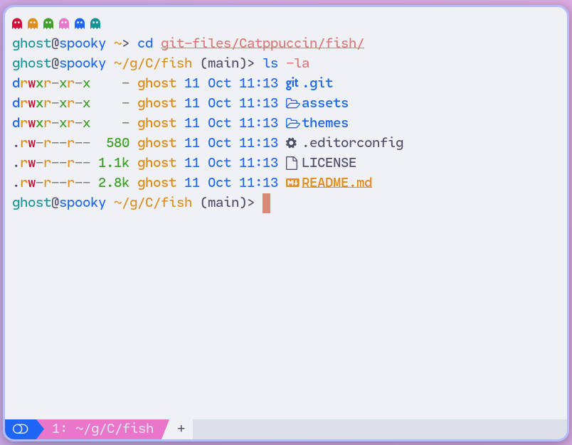
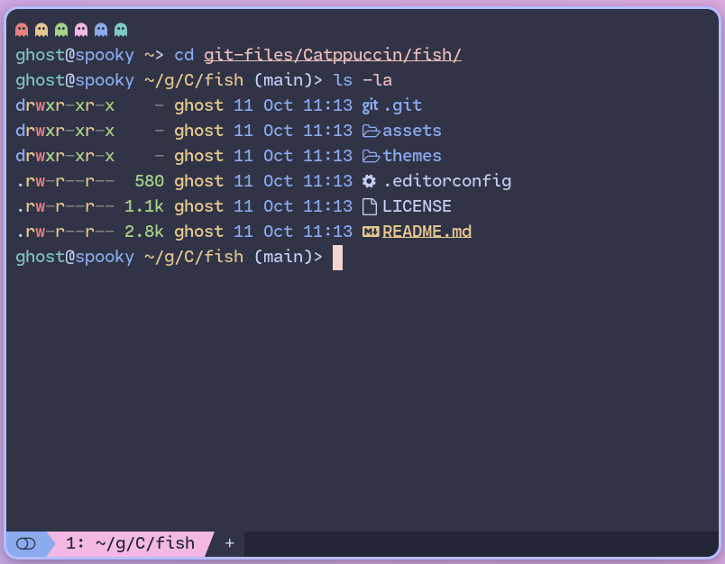
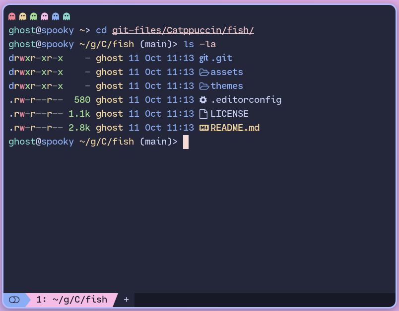
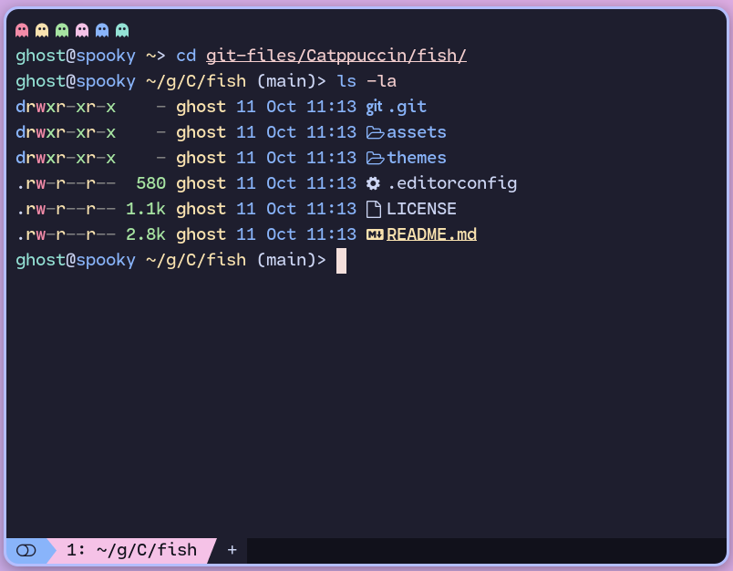

<h3 align="center">
	<br/>
	
	Catppuccin for <a href="https://github.com/fish-shell/fish-shell">Fish</a>
	
</h3>

<p align="center">
	<a href="https://github.com/catppuccin/fish/stargazers"></a>
	<a href="https://github.com/catppuccin/fish/issues"></a>
	<a href="https://github.com/catppuccin/fish/contributors"></a>
</p>

<p align="center">
	
</p>

## Previews

<details>
<summary>🌻 Latte</summary>

</details>
<details>
<summary>🪴 Frappé</summary>

</details>
<details>
<summary>🌺 Macchiato</summary>

</details>
<details>
<summary>🌿 Mocha</summary>

</details>

## Usage

1. Install with a plugin manager (see below) or manually by placing the theme file of your choice from [`themes/`](./themes/) under `~/.config/fish/themes/`.

- [Fisher](https://github.com/jorgebucaran/fisher)

```sh
fisher install catppuccin/fish
```

2. Set your Fish theme to your chosen flavor in `~/.config/fish/config.fish` :

```sh
fish_config theme choose "Catppuccin Frappe"
fish_config theme choose "Catppuccin Macchiato"
fish_config theme choose "Catppuccin Mocha"
```

> [!NOTE]
> You may want to pass the `--color-theme=dark` argument to ensure Fish shell applies the dark variant of your chosen flavor. For example, `fish_config theme choose "Catppuccin Mocha" --color-theme=dark` for the Mocha flavor.

## FAQ

- Q: **_Where's the Latte theme?_**\
  A: All three themes contain Latte as the light variant. Install any of them, and then set your system or terminal theme to light mode.

## 💝 Thanks to

- [Pocco81](https://github.com/Pocco81)
- [pigeon](https://github.com/backwardspy)

&nbsp;

<p align="center">
	
</p>

<p align="center">
	Copyright &copy; 2021-present <a href="https://github.com/catppuccin" target="_blank">Catppuccin Org</a>
</p>

<p align="center">
	<a href="https://github.com/catppuccin/catppuccin/blob/main/LICENSE"></a>
</p>
