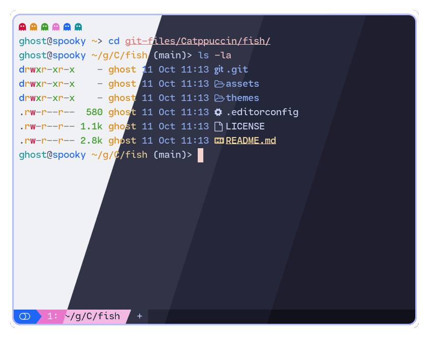
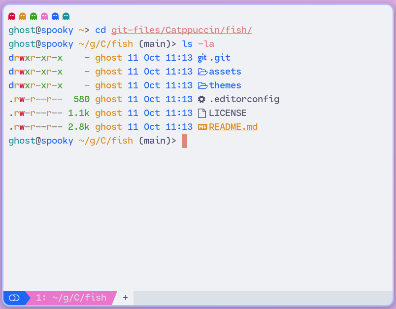
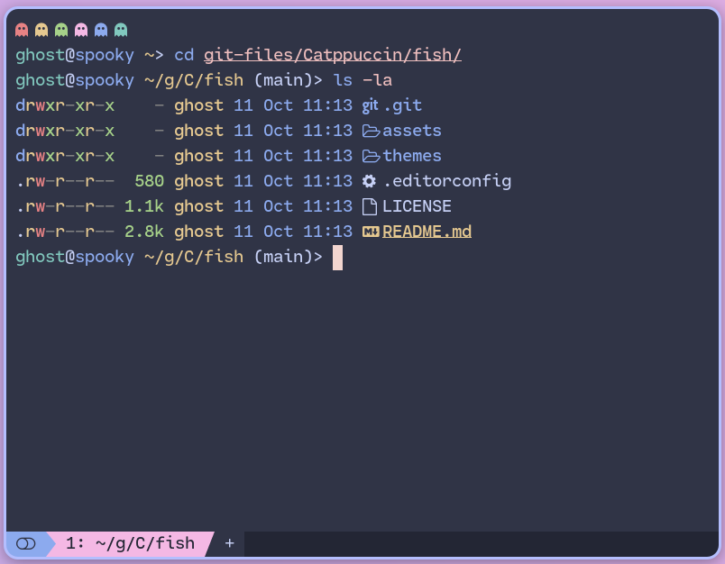
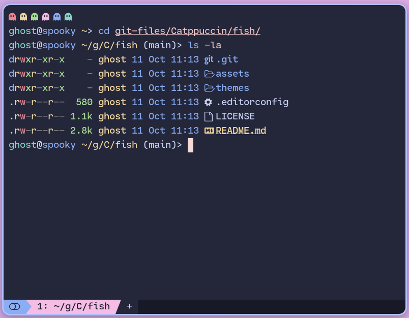
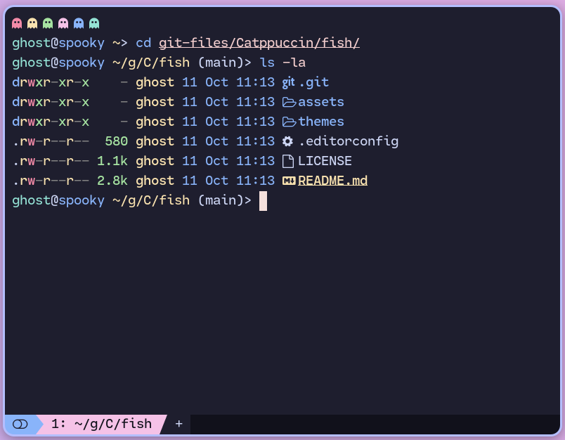

<h3 align="center">
	<br/>
	
	Catppuccin for <a href="https://github.com/fish-shell/fish-shell">Fish</a>
	
</h3>

<p align="center">
	<a href="https://github.com/catppuccin/fish/stargazers"></a>
	<a href="https://github.com/catppuccin/fish/issues"></a>
	<a href="https://github.com/catppuccin/fish/contributors"></a>
</p>

<p align="center">
	
</p>

## Previews

<details>
<summary>🌻 Latte</summary>

</details>
<details>
<summary>🪴 Frappé</summary>

</details>
<details>
<summary>🌺 Macchiato</summary>

</details>
<details>
<summary>🌿 Mocha</summary>

</details>

## Usage

> [!TIP]
> If you're using Fish [4.4.0](https://fishshell.com/docs/current/relnotes.html#fish-4-4-0-released-february-03-2026) or newer, all Catppuccin flavors are already included as theme options in Fish, so you can skip to Step 2 to set your Fish theme to your chosen Catppuccin flavor.

1. Install with a plugin manager (see below) or manually by placing the theme file of your choice from [`themes/`](./themes/) under `~/.config/fish/themes/`.

- [Fisher](https://github.com/jorgebucaran/fisher)

```sh
fisher install catppuccin/fish
```

2. Set your Fish theme to your chosen flavor in `~/.config/fish/config.fish` :

```sh
fish_config theme choose catppuccin-frappe
fish_config theme choose catppuccin-macchiato
fish_config theme choose catppuccin-mocha

# or if you only want dark mode:
fish_config theme choose catppuccin-frappeh --color-theme=dark
fish_config theme choose catppuccin-macchiato --color-theme=dark
fish_config theme choose catppuccin-mocha --color-theme=dark
```

> [!NOTE]
> If you are upgrading Fish to 4.3.0 or newer from an older version, it is recommended to remove the `~/.config/fish/conf.d/fish_frozen_theme.fish` file, to ensure you have a clean theme setting so Fish can properly apply the light or dark variant of your chosen theme. See [Fish's release notes for 4.3.0](https://fishshell.com/docs/current/relnotes.html#fish-4-3-0-released-december-28-2025) for more details about the migration.

### Static Themes

If you're using Fish 4.2 or earlier, or simply don't want to use the dynamic theme switching added in Fish 4.3, you can find static single-theme files in [`themes/static/`](./themes/static/). Install these manually into `~/.config/fish/themes/` and activate them with `fish_config theme choose "..."` as described above.

## 🙋 FAQ

- Q: **_Where's the Latte theme?_**\
  A: All three themes contain Latte as the light variant. Install any of them, and then set your system or terminal theme to light mode. Alternatively, run the following command:
  ```sh
  fish_config theme choose catppuccin-mocha --color-theme=light
  ```
  to force Fish to use light mode.

## 💝 Thanks to

- [Pocco81](https://github.com/Pocco81)
- [pigeon](https://github.com/backwardspy)

&nbsp;

<p align="center">
	
</p>

<p align="center">
	Copyright &copy; 2021-present <a href="https://github.com/catppuccin" target="_blank">Catppuccin Org</a>
</p>

<p align="center">
	<a href="https://github.com/catppuccin/catppuccin/blob/main/LICENSE"></a>
</p>
